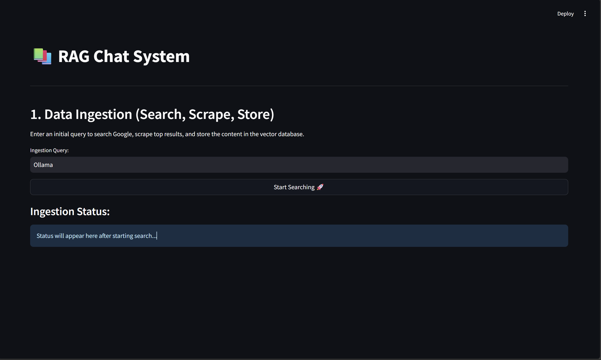
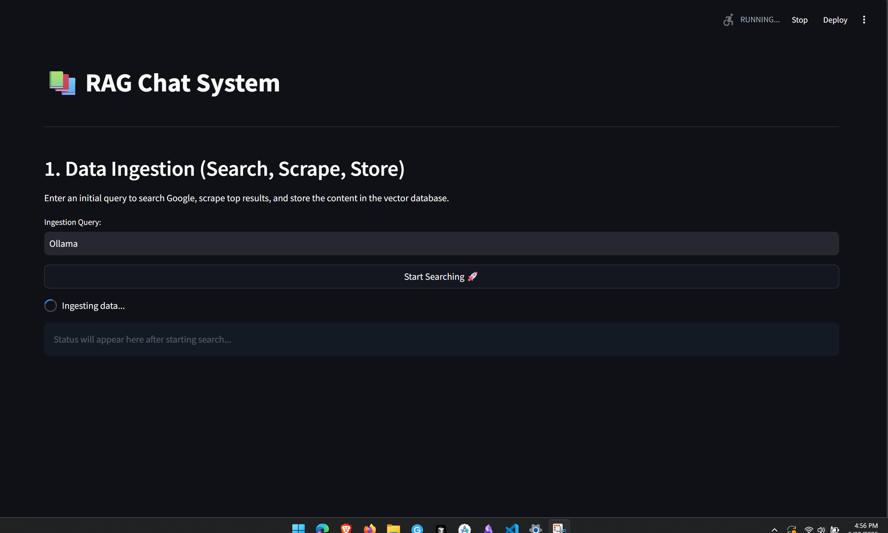
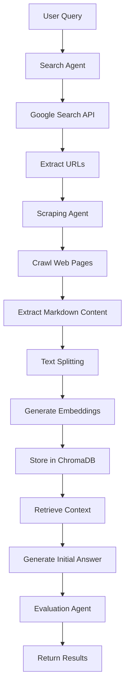
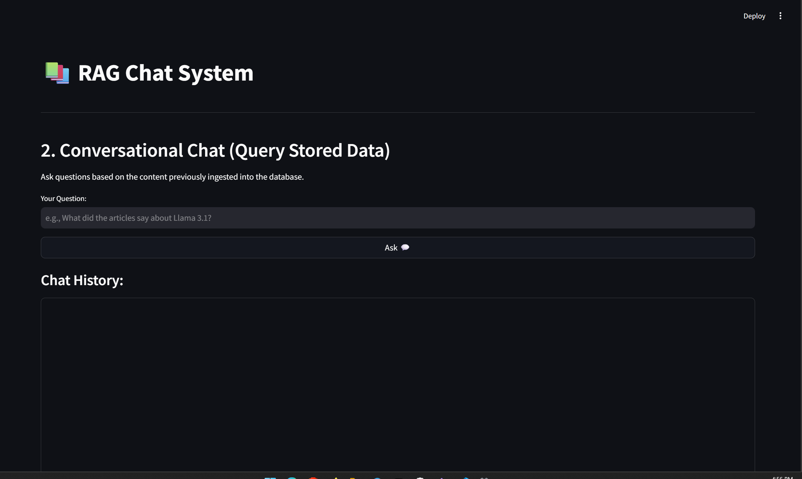
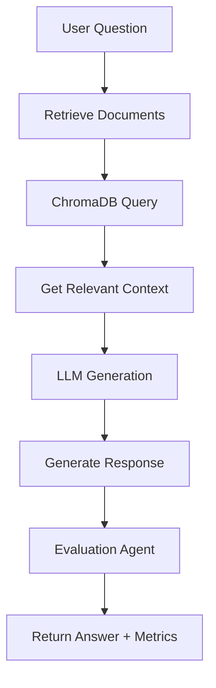
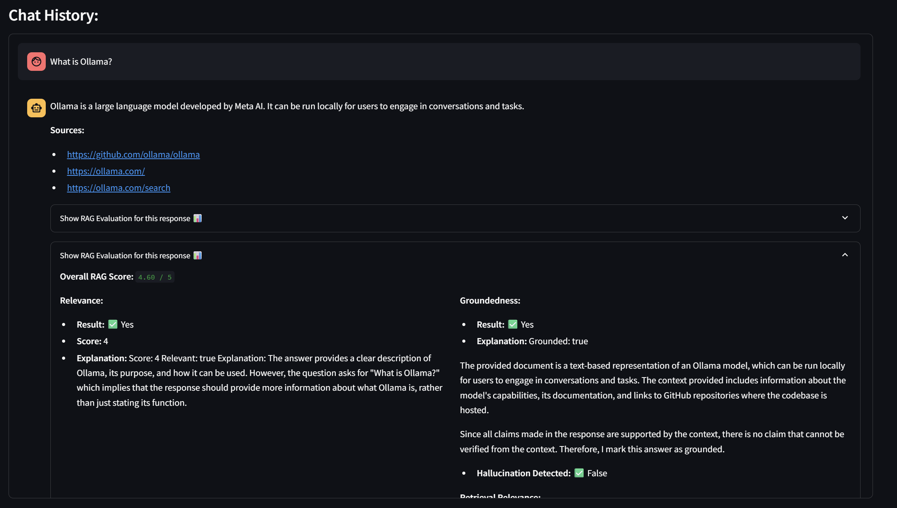
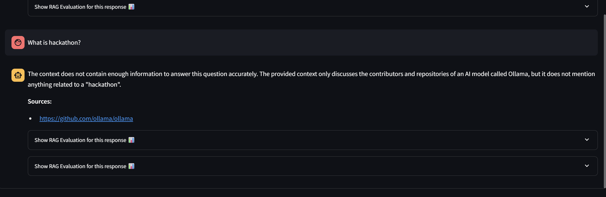

# Multi-Agent RAG System 🤖📚

A sophisticated Retrieval-Augmented Generation (RAG) system built with multiple specialized agents for intelligent document processing, real-time search, and conversational AI capabilities.

## 🌟 Overview

This Multi-Agent RAG System combines the power of web search, intelligent scraping, vector storage, and conversational AI to provide accurate, context-aware responses. The system uses a multi-agent architecture where specialized agents handle different aspects of the information retrieval and generation pipeline.



## 🏗️ System Architecture

The system is built around a multi-agent workflow using **LangGraph** for orchestration, with the following key components:

### Core Agents

1. **Search Agent** (`search_agent.py`)
   - Performs Google Custom Search API queries
   - Extracts top-N relevant URLs from search results
   - Configurable number of results (default: 3)

2. **Scraping Agent** (`scraping_agent.py`)
   - Uses `crawl4ai` for asynchronous web crawling
   - Extracts clean Markdown content from web pages
   - Handles multiple URLs concurrently

3. **Evaluation Agent** (`evaluation_agent.py`)
   - Provides comprehensive RAG evaluation metrics
   - Assesses answer quality, relevance, and groundedness
   - Uses dedicated LLM for objective evaluation

### RAG Components (`rag_components.py`)

- **Vector Database**: ChromaDB for persistent document storage
- **Embeddings**: Ollama embeddings (`mxbai-embed-large`)
- **LLM**: Local Ollama models (`llama3.2:1b` or `llama3.2:3b`)
- **Text Splitting**: Recursive character text splitter for optimal chunking

## 🔄 How the System Works

### Phase 1: Data Ingestion Pipeline



The ingestion pipeline follows this workflow:



**Step-by-step Process:**

1. **Search**: User provides a query → Search Agent queries Google Custom Search API
2. **URL Extraction**: Top relevant URLs are extracted from search results
3. **Scraping**: Scraping Agent crawls each URL and extracts clean content
4. **Processing**: Content is split into chunks and converted to embeddings
5. **Storage**: Embeddings and metadata stored in ChromaDB vector database
6. **Retrieval**: Relevant chunks retrieved based on query similarity
7. **Generation**: LLM generates initial answer using retrieved context
8. **Evaluation**: Comprehensive evaluation of the generated response

### Phase 2: Conversational Chat



After successful ingestion, users can engage in conversational chat:



## 📊 RAG Evaluation System

The system includes a comprehensive evaluation framework that assesses multiple dimensions:



### Evaluation Metrics

1. **Relevance (1-5 scale)**
   - How well the response addresses the user's question
   - Evaluates directness and completeness of the answer

2. **Groundedness (True/False)**
   - Whether the response is supported by the retrieved context
   - Ensures no hallucination or unsupported claims

3. **Correctness (True/False)**
   - Factual accuracy compared to ground truth (when available)
   - Validates the truthfulness of the generated response

4. **Retrieval Relevance (1-5 scale)**
   - Quality of the retrieved documents for answering the question
   - Assesses the effectiveness of the retrieval system

### Evaluation Process

```python
# Example evaluation output
{
    "overall_score": 4.60,
    "relevance": {
        "score": 5,
        "explanation": "Perfectly answers the question"
    },
    "groundedness": {
        "grounded": True,
        "explanation": "All claims supported by context"
    },
    "correctness": {
        "correct": True,
        "explanation": "Factually accurate information"
    },
    "retrieval_relevance": {
        "score": 4,
        "explanation": "Documents contain very useful information"
    }
}
```

## 🤝 Agent Communication & Orchestration

The system uses **LangGraph** for sophisticated agent orchestration:

### Communication Flow

1. **State Management**: Shared `GraphState` object maintains context across agents
2. **Node Execution**: Each agent operates as a node in the graph
3. **Conditional Routing**: Dynamic flow control based on intermediate results
4. **Error Handling**: Graceful fallbacks and error propagation

### Graph Structure

**Ingestion Graph:**
```
search → scrape_and_store → retrieve → generate_initial → evaluate_rag → END
```

**Chat Graph:**
```
generate_chat_response → evaluate_chat_response → END
```

### State Schema

```python
class GraphState(TypedDict):
    query: str                    # User query
    links: List[str]             # Extracted URLs
    scraped_content: Dict        # Scraped web content
    generation: str              # Generated response
    retrieved_elements: Dict     # Retrieved documents
    evaluation_results: Dict     # Evaluation metrics
    success: bool               # Operation status
    message: str                # Status message
```

## 🚀 Getting Started

### Prerequisites

- Python 3.8+
- Ollama installed locally
- Google Custom Search API credentials

### Installation

1. **Clone the repository:**
```bash
git clone <your-repo-url>
cd agents
```

2. **Install dependencies:**
```bash
pip install -r requirements.txt
```

3. **Set up environment variables:**
Create a `.env` file:
```env
GOOGLE_CSE_ID=your_custom_search_engine_id
GOOGLE_API_KEY=your_google_api_key
```

4. **Install Ollama models:**
```bash
ollama pull llama3.2:1b
ollama pull mxbai-embed-large
```

### Running the System

#### Option 1: Streamlit Web Interface
```bash
streamlit run streamlit_app.py
```

#### Option 2: FastAPI Backend
```bash
python app.py
```

#### Option 3: Command Line Interface
```bash
python main.py
```

## 📁 Project Structure

```
agents/
├── app.py                 # FastAPI backend application
├── streamlit_app.py       # Streamlit web interface
├── main.py               # CLI interface
├── rag_components.py     # Core RAG functionality
├── search_agent.py       # Google Search agent
├── scraping_agent.py     # Web scraping agent
├── evaluation_agent.py   # RAG evaluation agent
├── evaluator.py          # Evaluation logic and metrics
├── ingestion.py          # Data ingestion pipeline
├── chat_interface.py     # Conversational chat interface
├── chroma_store/         # Vector database storage
├── screenshots/          # System screenshots
└── .env                  # Environment variables
```

## 🔧 Configuration

### Model Configuration
- **Embedding Model**: `mxbai-embed-large` (can be changed in `rag_components.py`)
- **LLM Model**: `llama3.2:1b` (configurable, `llama3.2:3b` for better quality)
- **Chunk Size**: 1000 characters with 200 character overlap
- **Search Results**: Top 3 URLs (configurable)

### API Endpoints

**FastAPI Endpoints:**
- `POST /search` - Initial search and ingestion
- `POST /query` - Conversational chat
- `POST /clear_database` - Clear vector database

## 📸 Screenshots

### Data Ingestion Interface


### Chat Interface


### Evaluation Results


### No Context Scenario


## 🔍 Key Features

- **Multi-Agent Architecture**: Specialized agents for different tasks
- **Real-time Web Search**: Google Custom Search API integration
- **Intelligent Scraping**: Asynchronous web crawling with content extraction
- **Vector Storage**: Persistent ChromaDB for document embeddings
- **Comprehensive Evaluation**: Multi-dimensional RAG assessment
- **Multiple Interfaces**: Streamlit, FastAPI, and CLI options
- **Local LLM Support**: Ollama integration for privacy and control
- **Error Handling**: Robust error management and graceful fallbacks

## 🎯 Use Cases

- **Research Assistant**: Automated research with source verification
- **Knowledge Base**: Build searchable knowledge repositories
- **Q&A Systems**: Context-aware question answering
- **Content Analysis**: Evaluate and analyze web content
- **Educational Tool**: Learn about RAG systems and evaluation

## 🔒 Privacy & Security

- **Local Processing**: All LLM inference runs locally via Ollama
- **Data Control**: Full control over scraped and stored data
- **No External Dependencies**: Minimal reliance on external APIs (only Google Search)

## 🚧 Future Enhancements

- [ ] Support for multiple document formats (PDF, DOCX, etc.)
- [ ] Advanced query routing and intent classification
- [ ] Multi-modal capabilities (images, videos)
- [ ] Custom evaluation criteria configuration
- [ ] Distributed agent deployment
- [ ] Advanced caching mechanisms

## 📝 License

This project is licensed under the MIT License - see the LICENSE file for details.

## 🤝 Contributing

Contributions are welcome! Please feel free to submit a Pull Request.

---

**Built with ❤️ using LangGraph, ChromaDB, Ollama, and Streamlit**