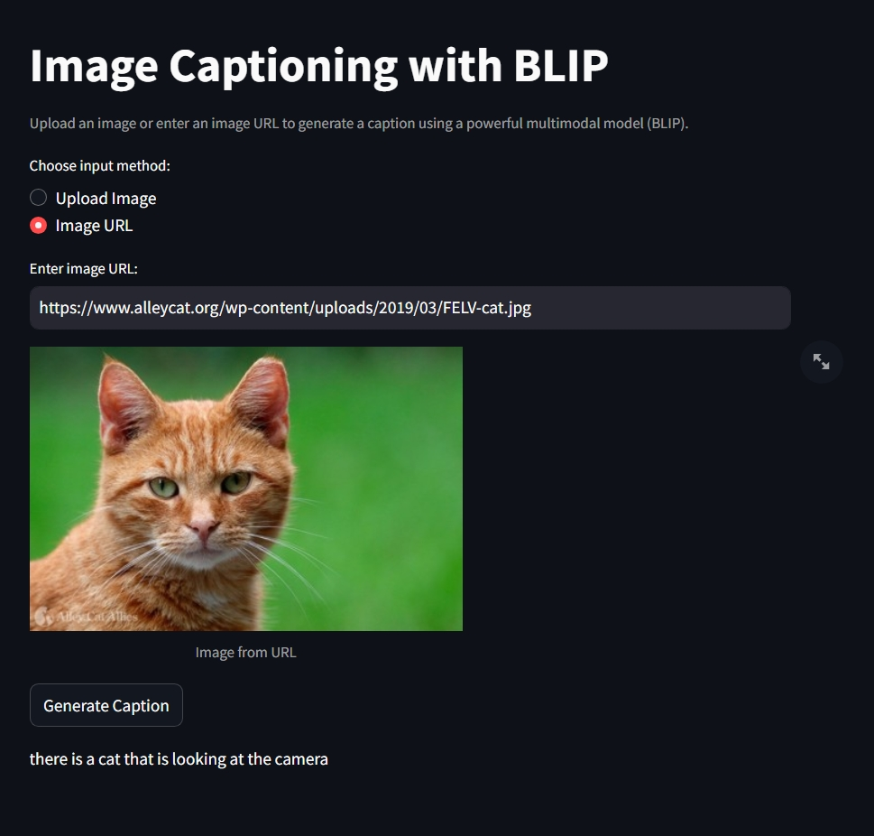

# BLIP Image Captioning Project

## Project Overview


## Sample Output

Below is a sample result showing the BLIP model in action:



The model generates detailed and accurate captions for a wide variety of images.


### Key Components:
- **FastAPI Backend** (`Blip.py`): RESTful API for image captioning
- **Streamlit Frontend** (`app.py`): User-friendly web interface
- **Jupyter Notebook** (`BLIP.ipynb`): Experimentation and model testing

## Features

- **Multiple Input Methods**: Upload images or provide URLs
- **State-of-the-art Model**: Uses Salesforce's BLIP large model
- **Real-time Processing**: Fast caption generation
- **Cross-platform Support**: Works with various image formats (JPG, JPEG, PNG)
- **RESTful API**: Easy integration with other applications
- **Interactive Web UI**: User-friendly Streamlit interface

## 🛠️ Technologies Used

- **Python 3.8+**: Core programming language
- **Transformers**: Hugging Face library for BLIP model
- **FastAPI**: High-performance web framework for API
- **Streamlit**: Frontend web application framework
- **PyTorch**: Deep learning framework
- **PIL (Pillow)**: Image processing library
- **Requests**: HTTP library for API calls

## Project Structure

```
assignment5/
├── app.py                  # Streamlit frontend application
├── Blip.py                 # FastAPI backend server
├── BLIP.ipynb             # Jupyter notebook for experimentation
├── requirements.txt        # Python dependencies
└── README.md              # Project documentation
```

## 🚀 Usage

### Running the Application

#### 1. Start the FastAPI Backend
```bash
uvicorn Blip:app --host 0.0.0.0 --port 8000 --reload
```
The API will be available at: `http://localhost:8000`

#### 2. Start the Streamlit Frontend
```bash
streamlit run app.py
```
The web interface will be available at: `http://localhost:8501`

### API Endpoints

#### POST `/caption/upload`
Upload an image file for captioning.

**Request:**
- Method: POST
- Content-Type: multipart/form-data
- Body: Image file

**Response:**
```json
{
  "caption": "a cat sitting on a table"
}
```

#### POST `/caption/url`
Caption an image from a URL.

**Request:**
```json
{
  "url": "https://example.com/image.jpg"
}
```

**Response:**
```json
{
  "caption": "a dog playing in the park"
}
```

### Using the Jupyter Notebook

Open and run `BLIP.ipynb` for experimentation:
```bash
jupyter notebook BLIP.ipynb
```

The notebook demonstrates:
- Model loading and initialization
- Conditional and unconditional image captioning
- Example with sample images

## 🧪 Model Details

### BLIP Model Specifications
- **Model**: Salesforce/blip-image-captioning-large
- **Architecture**: Vision Transformer + BERT-like language model
- **Parameters**: ~900M parameters
- **Input**: RGB images (any resolution, automatically resized)
- **Output**: Natural language captions

### Caption Generation Process
1. **Image Preprocessing**: Convert to RGB, resize and normalize
2. **Feature Extraction**: Extract visual features using Vision Transformer
3. **Language Generation**: Generate captions using transformer decoder
4. **Post-processing**: Decode tokens to readable text

## Example Usage

### Python Script Example
```python
import requests
from PIL import Image
from transformers import BlipProcessor, BlipForConditionalGeneration

# Load model
processor = BlipProcessor.from_pretrained("Salesforce/blip-image-captioning-large")
model = BlipForConditionalGeneration.from_pretrained("Salesforce/blip-image-captioning-large")

# Load and process image
image = Image.open("path/to/image.jpg")
inputs = processor(image, return_tensors="pt")

# Generate caption
output = model.generate(**inputs)
caption = processor.decode(output[0], skip_special_tokens=True)
print(caption)
```

### API Usage Example
```python
import requests

# Upload image
with open("image.jpg", "rb") as f:
    response = requests.post("http://localhost:8000/caption/upload", files={"file": f})
    result = response.json()
    print(result["caption"])

# Use image URL
response = requests.post("http://localhost:8000/caption/url", 
                        json={"url": "https://example.com/image.jpg"})
result = response.json()
print(result["caption"])
```
